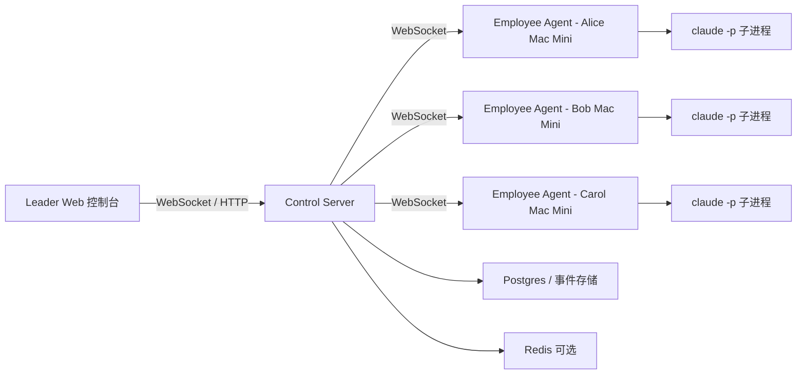
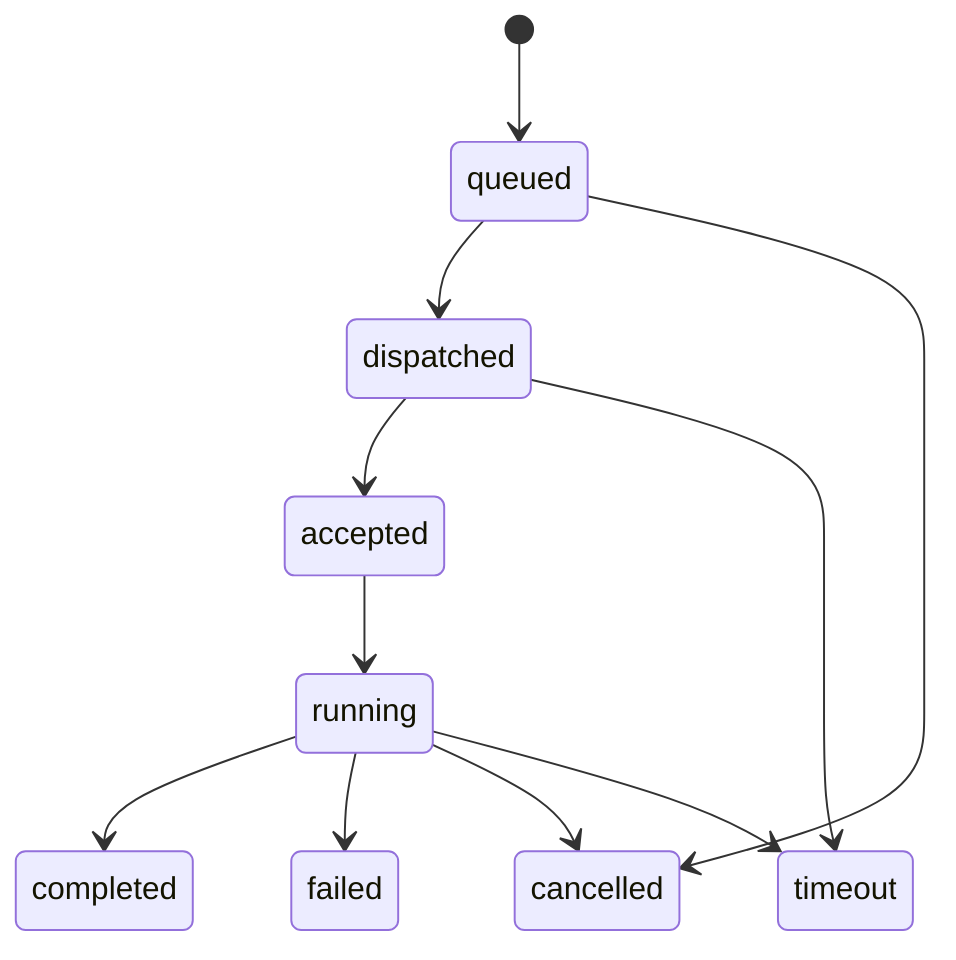

# AI Teams 系统设计

## 1. 目标

构建一个多智能体执行系统，每个 AI 员工运行在独立的 Mac Mini 上。

- 每台员工机器运行一个本地 Agent 进程。
- 本地 Agent 通过 `claude -p` 以无头模式调用 Claude Code。
- 中央服务端通过 WebSocket 协调所有员工。
- 人类 Leader 通过 Web 控制台向单个员工或多个员工下达指令。
- 每个员工的执行输出实时回传，并显示在对应员工的监控窗口中。

这个设计和你给出的原型一致：左侧导航，中间员工监控面板，右侧 Leader 指挥面板。

## 2. 核心角色

- Leader
  - 人类操作员
  - 负责任务下发、查看进度、取消任务、重试任务
- Control Server
  - 接收 Leader 指令
  - 维护员工 Agent 的 WebSocket 会话
  - 路由指令并聚合任务事件
- Employee Agent
  - 运行在每台 Mac Mini 上
  - 与服务端保持长连接
  - 通过 `claude -p` 执行本地任务
  - 回传 stdout、stderr、状态和最终结果
- Claude Runner
  - Employee Agent 内部的子进程包装层
  - 负责启动、监控、终止 `claude -p`

## 3. 总体架构



## 4. 模块拆分

### 4.1 Leader Web 控制台

主要界面：

- 监控大盘
  - 员工卡片网格
  - 展示当前任务、实时输出、状态、机器健康度
- Leader 指挥中心
  - 向单个员工、多个员工或全部员工发送指令
  - 展示指令历史和员工回复
- 员工管理
  - 注册员工元数据
  - 配置角色、标签、工作目录、并发设置
- 任务日志
  - 查询历史执行记录、耗时、结果、失败原因

### 4.2 Control Server

主要职责：

- 对 Leader UI 和 Employee Agent 做认证
- 维护员工在线/离线状态
- 将指令路由到目标员工
- 持久化任务、事件、日志
- 向 UI 广播实时更新
- 处理重试、取消、超时、心跳逻辑

建议内部服务拆分：

- `ws-gateway`
- `agent-session-service`
- `task-dispatch-service`
- `task-event-service`
- `employee-service`
- `leader-command-service`

### 4.3 Mac Mini 上的 Employee Agent

主要职责：

- 启动时带上机器身份和认证 Token
- 通过 WebSocket 连接 Control Server
- 上报机器元数据
- 接收任务并放入本地执行队列
- 调用 `claude -p`
- 按行或按块实时输出日志
- 支持取消和超时
- 支持断线重连后的状态恢复

建议本地进程内部分层：

- `agent-core`
- `ws-client`
- `task-queue`
- `claude-runner`
- `workspace-manager`

## 5. 建议执行模型

每个员工默认只允许 **单任务执行**。

原因：

- 一个员工只维护一个 Claude 会话，语义最清晰
- 和原型中的“一个员工一块监控面板”完全一致
- 避免在同一工作目录下并发改代码
- 取消、重试、实时输出实现都更简单

后续可以按员工扩展：

- `maxConcurrentTasks = 1` 作为默认值
- `maxConcurrentTasks > 1` 仅在每个任务绑定独立 workspace 时启用

## 6. 核心任务流程

### 6.1 单人指令流程

1. Leader 在 UI 中输入指令。
2. 服务端创建一个 `task`。
3. 服务端向目标员工推送 `task.dispatch`。
4. Employee Agent 确认接收。
5. Employee Agent 启动 `claude -p "<prompt>"`。
6. Employee Agent 持续回传输出事件。
7. 服务端持久化事件并广播给 UI。
8. Employee Agent 最终发送 `task.completed` 或 `task.failed`。

### 6.2 广播指令流程

1. Leader 选择全部员工或某个分组。
2. 服务端创建一个 `leader_command`。
3. 服务端把它展开成多条 `task` 记录，每个员工一条。
4. 每个员工收到自己的任务实例。
5. UI 展示同一条 Leader 指令下，不同员工的独立执行窗口。

这里有一个关键建模：

广播必须被视为 **一条逻辑指令，多条物理任务**。

## 7. 实时输出设计

核心体验要求是：员工执行过程必须实时显示在员工卡片里，而不是只显示最终结果。

因此 Agent 应该上传结构化事件，而不是只回传最后一段文本。

建议事件类型：

- `task.accepted`
- `task.started`
- `task.output`
- `task.thinking`
- `task.progress`
- `task.completed`
- `task.failed`
- `task.cancelled`
- `agent.heartbeat`
- `agent.status`

`task.output` 示例：

```json
{
  "type": "task.output",
  "taskId": "task_123",
  "employeeId": "emp_alice",
  "stream": "stdout",
  "seq": 18,
  "content": "Analyzing src/pages/Login.tsx..."
}
```

说明：

- `seq` 必须存在，用于断线重连后恢复输出顺序。
- 输出应采用追加模式，而不是整体覆盖。
- UI 侧应保留一个滚动缓冲区，保证渲染流畅。

## 8. WebSocket 协议设计

Leader 浏览器和 Employee Agent 都与服务端保持一个持久 WebSocket 连接。

### 8.1 Server -> Employee

```json
{
  "type": "task.dispatch",
  "taskId": "task_123",
  "leaderCommandId": "cmd_456",
  "employeeId": "emp_alice",
  "workspace": "/Users/agent/workspaces/project-a",
  "prompt": "Analyze login redirect issue and provide a fix",
  "timeoutSec": 1800,
  "runMode": "claude_headless"
}
```

### 8.2 Employee -> Server

Agent 注册：

```json
{
  "type": "agent.register",
  "employeeId": "emp_alice",
  "machineId": "macmini-a01",
  "hostname": "macmini-a01.local",
  "capabilities": {
    "claude": true,
    "headless": true
  },
  "labels": ["frontend", "react"],
  "maxConcurrentTasks": 1
}
```

任务启动：

```json
{
  "type": "task.started",
  "taskId": "task_123",
  "employeeId": "emp_alice",
  "startedAt": "2026-04-18T14:10:00Z",
  "pid": 34821
}
```

任务结束：

```json
{
  "type": "task.completed",
  "taskId": "task_123",
  "employeeId": "emp_alice",
  "exitCode": 0,
  "summary": "Fixed redirect logic and tests passed",
  "finishedAt": "2026-04-18T14:18:12Z"
}
```

### 8.3 Server -> Leader UI

UI 接收统一归一化后的事件流：

- 员工在线/离线状态
- 员工任务状态变化
- 任务输出片段
- Leader 指令历史
- 聚合进度信息

## 9. 本地 Agent 执行约定

Employee Agent 应该把 `claude -p` 封装在一个稳定的 Runner 适配层后面。

伪接口：

```ts
interface TaskRunner {
  start(task: DispatchTask): Promise<RunningTask>;
  cancel(taskId: string): Promise<void>;
}
```

执行步骤：

1. 校验 workspace 是否存在。
2. 组装子进程参数。
3. 启动 `claude -p`。
4. 监听 stdout/stderr。
5. 持续发送结构化状态更新。
6. 收到取消或超时后终止进程。
7. 本地保存崩溃恢复所需元数据。

推荐命令形态：

```bash
claude -p "Analyze login redirect issue and provide a fix"
```

后续可以扩展：

- 指定工作目录
- 注入环境变量
- 附带代码仓库元数据
- 附带任务模板

## 10. 任务状态机



建议前端展示状态：

- Offline
- Idle
- Queued
- Running
- Success
- Failed
- Cancelled

## 11. 数据模型

服务端最小表结构：

### `employees`

- `id`
- `name`
- `machine_id`
- `hostname`
- `role`
- `labels_json`
- `status`
- `last_seen_at`
- `max_concurrent_tasks`

### `leader_commands`

- `id`
- `leader_user_id`
- `scope_type`，取值 `single`、`group`、`all`
- `scope_value`
- `prompt`
- `created_at`

### `tasks`

- `id`
- `leader_command_id`
- `employee_id`
- `workspace`
- `status`
- `timeout_sec`
- `started_at`
- `finished_at`
- `exit_code`
- `summary`

### `task_events`

- `id`
- `task_id`
- `employee_id`
- `event_type`
- `seq`
- `payload_json`
- `created_at`

关键点：

- `task_events` 必须采用 append-only 设计。
- 实时 UI 可以通过最近事件重建员工卡片状态。

## 12. 原型 UI 映射

### 左侧导航

- AI 团队
- 监控台
- 员工管理
- 任务日志
- 异常记录
- 统计分析

### 中间网格区

每个员工一张卡片，展示：

- 员工名称
- 角色标签
- 在线状态
- 当前任务标题
- 实时控制台输出
- 已运行时长
- 快捷操作：停止、重试、聚焦

### 右侧指挥面板

- 指令输入框
- 目标员工选择器
- 全员发送开关
- 指令历史
- 员工回复与摘要

## 13. 故障与恢复策略

### 网络中断

- Agent 自动重连
- 服务端在心跳超时后将员工标记为 `offline`
- 重连后 Agent 上报：
  - 当前运行中的任务
  - 最近输出的 `seq`
  - 本地进程状态

### Agent 进程崩溃

- 本地 Supervisor 自动拉起 Employee Agent
- Agent 重启后检查 `claude -p` 子进程是否仍然存在
- 如果仍在运行，尽量恢复监控；否则标记任务失败

### Claude 进程卡死

- 服务端超时和本地超时都必须存在
- 任务运行过程中 Agent 需要周期性发送进度心跳
- 如果长时间没有输出且没有心跳，则标记为疑似卡死

## 14. 安全模型

最低要求：

- 每个 Employee Agent 独立 Token
- WebSocket 走 TLS
- Leader 用户独立认证
- 服务端校验 Leader 是否有权限控制对应员工
- 所有指令和输出都可审计

强烈建议：

- 每个员工配置允许访问的 workspace 白名单
- 对指令长度做限制
- 对环境变量做脱敏
- 在广播给 UI 前对输出做敏感信息过滤

## 15. MVP 范围

第一阶段不要一次性把系统做得过重。

### MVP 包含

- 员工注册和心跳
- Leader 向单个员工发送任务
- Leader 向全员广播任务
- 本地执行 `claude -p`
- 实时 stdout/stderr 流式输出
- 任务状态流转
- 取消任务
- 员工监控大盘
- 任务/事件持久化

### 延后到第二阶段

- 分组路由策略
- 任务模板
- 多 workspace 调度
- 制品上传
- 自动任务拆分
- Agent 之间协作
- 审批流

## 16. 推荐技术栈

优先采用便于快速落地的技术组合：

- 前端：React + Ant Design
- 实时网关：NestJS WebSocket 或 Socket.IO Gateway
- API 服务：NestJS
- 数据库：Postgres
- 缓存 / 发布订阅：Redis
- 本地 Agent：Node.js 服务
- 进程执行：Node `child_process.spawn`

为什么本地 Agent 用 Node：

- WebSocket 客户端处理简单
- 子进程输出流接入方便
- 与前端、服务端语言统一
- 对 MVP 足够高效

## 17. 第一阶段交付计划

### 迭代 1

- 确定事件协议
- 搭建 Control Server WebSocket 网关
- 实现 Employee Agent 注册和心跳
- 实现单任务下发
- 做出基础版员工监控卡片

### 迭代 2

- 增加实时输出流
- 增加广播指令
- 增加任务持久化
- 增加取消和超时

### 迭代 3

- 增加员工管理
- 增加历史日志
- 增加断线重连恢复

## 18. 关键设计决策

1. 一个员工对应一台 Mac Mini 上的一个常驻 Agent 进程。
2. 一条 Leader 指令可以扇出为多个员工任务。
3. `task_events` 是实时回放和审计的事实来源。
4. 员工输出必须以结构化事件流方式上传，而不是只回最终文本。
5. 每个员工默认并发数为 `1`。
6. 第一版系统优先解决可观测性和可控性，而不是自主协作能力。

## 19. 下一步建议

建议先做这几项明确交付：

1. 敲定 WebSocket 消息协议。
2. 固化最小任务状态机。
3. 初始化三个应用包：
   - `apps/web`
   - `apps/server`
   - `apps/agent`
4. 在接入真实 `claude -p` 之前先做一个 fake runner。

先做 fake runner 很重要，因为这样可以先把“服务端调度 + UI 实时输出 + 员工状态面板”整条链路跑通，再接 Claude 的真实执行行为。
